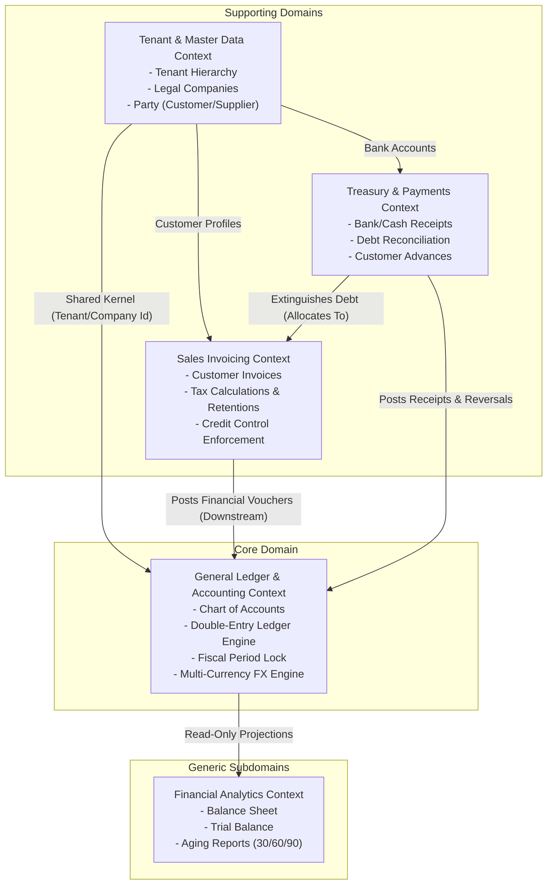

# Domain-Driven Design (DDD) Business Specification & Rules

**Project:** Multi-Tenant Cloud ERP Core  
**Methodology:** Strategic & Tactical Domain-Driven Design (DDD)  
**Status:** APPROVED & MANDATORY  
**Target Domain:** Enterprise Accounting, Sales Invoicing & Treasury Reconciliation  

---

## 1. Strategic Design: Ubiquitous Language (Lenguaje Ubicuo)

The following terms define the shared, unambiguous language between financial domain experts, auditors, and software engineers:

| Term (Ubiquitous Language) | Spanish Equivalent | Business Definition & Boundary |
| :--- | :--- | :--- |
| **Tenant** | Inquilino / Organización | The top-level isolation boundary representing an independent customer organization. |
| **Company** | Empresa / Entidad Legal | A legal tax entity operating under a Tenant. Holds its own Chart of Accounts, currency, and tax ID. |
| **Chart of Accounts (COA)** | Plan de Cuentas | The hierarchical taxonomy of all financial accounts (Assets, Liabilities, Equity, Income, Expenses). |
| **Group Account** | Cuenta de Grupo / Mayor | A non-posting parent folder in the COA used solely for summarizing sub-account balances. Direct postings are forbidden. |
| **Leaf / Posting Account** | Cuenta Auxiliar / Afectable | A terminal account in the COA where journal entries can be booked. |
| **General Ledger (GL)** | Libro Mayor | The immutable central repository of all financial transactions recorded as debits and credits. |
| **GL Entry** | Asiento / Línea de Mayor | An atomic, immutable record in the General Ledger representing a single debit or credit movement. |
| **Double-Entry Balance** | Partida Doble | The fundamental accounting law stating that total debits must equal total credits for any voucher ($\sum D = \sum C$). |
| **Sales Invoice** | Factura de Venta | A commercial claim for payment issued to a Customer for goods or services delivered. |
| **Payment Entry** | Recibo de Pago / Cobro | A treasury transaction recording the inflow of money into a liquid asset account (Bank/Cash). |
| **Payment Allocation** | Asignación de Pago | The association between a Payment Entry and a Sales Invoice, reducing the invoice's outstanding balance. |
| **Outstanding Amount** | Saldo Pendiente | The remaining unpaid monetary value of a posted invoice ($\text{GrandTotal} - \sum \text{Allocations}$). |
| **Advance Payment** | Anticipo de Cliente | The unallocated surplus of a payment where $\text{PaidAmount} > \sum \text{AllocatedAmount}$. |
| **Fiscal Period Lock** | Cierre de Periodo Fiscal | An administrative boundary preventing any new or altered entries within a closed date range. |
| **Reversal Entry** | Contrasiento / Anulación | A compensatory transaction created to nullify an existing voucher by posting opposite debits and credits. |
| **Realized FX Gain/Loss** | Ganancia/Pérdida Cambiaria | Financial variance resulting from differences in exchange rates between invoice posting date and payment date. |
| **Withholding Tax** | Retención de Impuesto | Direct tax deduction withheld by the customer and paid to tax authorities on behalf of the issuer. |

---

## 2. Strategic Design: Bounded Contexts & Context Map



---

## 3. Tactical Design: Aggregates, Entities & Value Objects

### 3.1 Aggregate 1: `SalesInvoice` (Billing Bounded Context)

- **Aggregate Root:** `SalesInvoice`
- **Internal Entities:** `SalesInvoiceItem`
- **Value Objects:**
  - `Money` (`Amount: decimal`, `Currency: string`)
  - `TaxRate` (`Percentage: decimal`, `TaxType: string`)
  - `InvoiceStatus` (`Draft`, `Posted`, `PartiallyPaid`, `Paid`, `Cancelled`)
  - `VoucherNumber` (e.g. `SINV-2026-00001`)

#### Invariants & Business Rules of `SalesInvoice`:
1. **State Machine Invariant:**
   - Edits (adding/removing items, changing quantities/prices) are permitted **only** when `Status == Draft`.
   - Once `Status == Posted`, the invoice becomes strictly read-only.
2. **Item Line Calculation Invariant:**
   $$\text{LineTotal} = \text{Round}(\text{Quantity} \times \text{UnitPrice}, 4)$$
   $$\text{TaxAmount} = \text{Round}(\text{LineTotal} \times (\text{TaxRatePercentage} / 100), 4)$$
3. **Grand Total Invariant:**
   $$\text{SubTotal} = \sum \text{LineTotal}$$
   $$\text{TaxTotal} = \sum \text{TaxAmount}$$
   $$\text{GrandTotal} = \text{SubTotal} + \text{TaxTotal}$$
4. **Posting Pre-conditions:**
   - Must contain at least one line item ($\text{Items.Count} \ge 1$).
   - `PostingDate` must fall within an open fiscal period.
   - Customer must have a configured `DefaultReceivableAccountId`.

---

### 3.2 Aggregate 2: `Account` (General Ledger Bounded Context)

- **Aggregate Root:** `Account`
- **Value Objects:**
  - `AccountCode` (e.g. `1110.01`)
  - `RootType` (`Asset`, `Liability`, `Equity`, `Income`, `Expense`)

#### Invariants & Business Rules of `Account`:
1. **Leaf-Posting Invariant:** Direct ledger postings (`GLEntry`) are permitted **only** if `IsGroup == false`. Attempting to post to an account where `IsGroup == true` throws `GroupAccountPostingException`.
2. **Root Type Inheritance Invariant:** A child account must inherit the `RootType` of its parent account.
3. **Delete Invariant:** An account cannot be deleted if it has at least one child account OR at least one historical `GLEntry`.

---

### 3.3 Aggregate 3: `PaymentEntry` (Treasury Bounded Context)

- **Aggregate Root:** `PaymentEntry`
- **Internal Entities:** `PaymentAllocation`
- **Value Objects:**
  - `PaymentType` (`Receive`, `Pay`, `InternalTransfer`)
  - `PaymentStatus` (`Draft`, `Submitted`, `Cancelled`)

#### Invariants & Business Rules of `PaymentEntry`:
1. **Positive Cash Invariant:** `PaidAmount` must be strictly greater than zero ($> 0.0000$).
2. **Anti-Overpayment Invariant:**
   $$\forall \text{ allocation}_i: \text{allocation}_i.\text{AllocatedAmount} \le \text{Invoice}_i.\text{OutstandingAmount}$$
   An allocation cannot exceed the current debt of the target invoice.
3. **Advance Payment Calculation:**
   $$\text{AllocatedAmount} = \sum \text{allocation}_i.\text{AllocatedAmount}$$
   $$\text{UnallocatedAmount} = \text{PaidAmount} - \text{AllocatedAmount}$$
   If $\text{UnallocatedAmount} > 0$, it is stored as an advance credit associated with the customer.
4. **Invoice State Transition Rules:**
   - If $\text{Invoice}.\text{OutstandingAmount} == 0 \implies \text{Status} = \text{Paid}$.
   - If $0 < \text{Invoice}.\text{OutstandingAmount} < \text{GrandTotal} \implies \text{Status} = \text{PartiallyPaid}$.

---

### 3.4 Aggregate 4: `GLEntry` (Immutable Core Ledger)

- **Entity / Record:** `GLEntry`
- **Invariants:**
  1. **Strict Double-Entry Zero-Sum:**
     $$\sum \text{Debit} - \sum \text{Credit} = 0.0000$$
     Any transaction failing this check is immediately rejected.
  2. **Non-Negative Monies:** $\text{Debit} \ge 0$ and $\text{Credit} \ge 0$.
  3. **Mutual Exclusivity:** A single `GLEntry` row must have either $\text{Debit} > 0$ or $\text{Credit} > 0$, but never both simultaneously.
  4. **Append-Only Immutability:** No `UPDATE` or `DELETE` allowed.

---

## 4. Tactical Design: Domain Events

```csharp
namespace Erp.Domain.Events;

public record SalesInvoiceCreatedDomainEvent(Guid InvoiceId, Guid CustomerId, decimal GrandTotal);
public record SalesInvoicePostedDomainEvent(Guid InvoiceId, string DocumentNumber, Guid CustomerId, decimal GrandTotal);
public record SalesInvoiceCancelledDomainEvent(Guid InvoiceId, string Reason);

public record PaymentReceivedDomainEvent(Guid PaymentId, Guid CustomerId, decimal PaidAmount);
public record PaymentAllocatedToInvoiceDomainEvent(Guid PaymentId, Guid InvoiceId, decimal AllocatedAmount, decimal RemainingInvoiceBalance);
public record InvoiceFullyPaidDomainEvent(Guid InvoiceId, string DocumentNumber);
public record InvoicePartiallyPaidDomainEvent(Guid InvoiceId, string DocumentNumber, decimal RemainingBalance);

public record GeneralLedgerVoucherPostedDomainEvent(string VoucherType, string VoucherNo, decimal TotalBalance);
```

---

## 5. Domain Services

### 5.1 `InvoicePostingDomainService`
- **Responsibility:** Orchestrates invoice transition to `Posted`, queries customer receivable account, verifies double-entry balance, and inserts atomic ledger entries.

### 5.2 `PaymentReconciliationDomainService`
- **Responsibility:** Validates payment allocations against open invoices, updates outstanding balances, assigns advance credits, and generates balanced bank-to-receivable ledger entries.

---

## 6. Multi-Currency & Foreign Exchange Gain/Loss Policy

In global commerce, invoices and payments may be denominated in foreign currencies ($C_{\text{doc}}$) differing from the Company Operating Currency ($C_{\text{base}}$).

### 6.1 Policy Rules
1. **Base Currency Representation:** Every `GLEntry` stores the amount in both Document Currency (`Debit`, `Credit`) and Operating Currency (`DebitBase`, `CreditBase`) using the exchange rate effective on `PostingDate`.
2. **Realized Foreign Exchange Variance (Diferencial Cambiario):**
   When a payment settles an invoice at an exchange rate different from the invoice's posting rate:
   - Calculate Base Currency Invoice Value: $V_{\text{inv}} = \text{AllocatedAmount} \times R_{\text{invoice}}$
   - Calculate Base Currency Payment Value: $V_{\text{pay}} = \text{AllocatedAmount} \times R_{\text{payment}}$
   - Calculate Variance: $\Delta_{\text{FX}} = V_{\text{pay}} - V_{\text{inv}}$
   - **If $\Delta_{\text{FX}} > 0$ (Exchange Gain):**
     - Credit: `4210 - Realized Foreign Exchange Gain` (Income Account).
   - **If $\Delta_{\text{FX}} < 0$ (Exchange Loss):**
     - Debit: `5210 - Realized Foreign Exchange Loss` (Expense Account).
3. **Ledger Invariant:** Even with currency conversions, operating currency debits and credits must balance exactly: $\sum \text{DebitBase} = \sum \text{CreditBase}$.

---

## 7. Tax Engine & Withholding Policy (Retenciones de Impuestos)

Enterprise accounting requires supporting standard output taxes (VAT / IVA) and customer tax withholdings (Retenciones).

### 7.1 Tax Types & Computational Rules
1. **Sales VAT / IVA (Output Tax):**
   - Booked to a Liability Account (`2110 - Taxes Payable / IVA por Pagar`).
   - Added to the customer's total payable debt: $\text{GrandTotal} = \text{SubTotal} + \text{TaxTotal}$.
2. **Withholding Tax (Retención de Impuestos):**
   - In jurisdictions requiring B2B tax withholding, the customer deducts tax at source and pays it directly to the tax authority.
   - Deducted from Accounts Receivable and booked to an Asset Prepayment Account (`1130 - Tax Withheld at Source / Anticipo de Impuestos`):
     - **Debit:** Accounts Receivable = $\text{GrandTotal} - \text{WithholdingAmount}$.
     - **Debit:** Tax Withheld at Source = $\text{WithholdingAmount}$.
     - **Credit:** Sales Revenue = $\text{SubTotal}$.
     - **Credit:** VAT Payable = $\text{TaxTotal}$.

---

## 8. Fiscal Calendar & Period Lock Engine (Cierre de Periodo)

To comply with accounting compliance frameworks, historical financial records must be protected from backdated tampering.

### 8.1 Period Statuses & Lock Rules
1. **Open Period:** Normal posting, drafts, and payments permitted.
2. **Soft Close:** Only designated Financial Controllers can post entries. Standard billing clerks are blocked.
3. **Hard Close (Locked Period):** No postings, reversals, or adjustments permitted on or before `LockDate`. Attempting to post throws `FiscalPeriodLockedException`.
4. **Year-End Closing (Cierre Anual):**
   - At fiscal year end, a zero-out voucher automatically computes Net Income:
     $$\text{NetIncome} = \sum \text{Income Accounts} - \sum \text{Expense Accounts}$$
   - Clears all nominal Income and Expense accounts to zero balance.
   - Transfers `NetIncome` into Equity account `3120 - Retained Earnings / Resultados Acumulados`.

---

## 9. Customer Credit Control & Aging Policy

To prevent bad debt exposure, the system evaluates customer solvency prior to invoice submission.

### 9.1 Rules & Constraints
1. **Credit Limit Check:**
   $$\text{CurrentExposure} = \sum \text{Unpaid Invoices} + \text{CurrentInvoice}.\text{GrandTotal} - \text{AdvanceCredits}$$
   If $\text{CurrentExposure} > \text{Customer}.\text{CreditLimit}$ and $\text{Customer}.\text{EnforceCreditLimit} == \text{true}$:
   - Invoice posting is blocked with `CreditLimitExceededException` unless explicitly overridden by an authorized Credit Manager.
2. **Aging Buckets:**
   Accounts Receivable are categorized dynamically by days past due:
   - **Current:** $0 - 30$ days.
   - **Tier 1:** $31 - 60$ days.
   - **Tier 2:** $61 - 90$ days.
   - **Delinquent:** $> 90$ days (automatically flags customer as on Credit Hold).

---

## 10. Cash Discount & Early Payment Terms (Pronto Pago)

### 10.1 Business Rules
1. **Payment Terms Definition:** A term (e.g., `2/10 Net 30`) grants a 2% discount if payment is received within 10 days of the invoice date.
2. **Discount Accounting Posting:**
   When an early payment discount is applied:
   - Debit: Bank Account for the discounted cash received.
   - Debit: `5120 - Sales Cash Discounts Allowed` (Expense / Contra-Revenue account) for the discount amount.
   - Credit: Accounts Receivable for the full gross invoice amount.
   - Result: Invoice status is marked `Paid` with zero remaining balance.

---

## 11. Exhaustive State Transition Matrix

### 11.1 Sales Invoice State Matrix

| Current State | Target State | Triggering Action | Allowed? | Pre-conditions & Validation | Resulting System Effect |
| :--- | :--- | :--- | :--- | :--- | :--- |
| `Draft` | `Posted` | `PostInvoiceCommand` | **YES** | At least 1 item; open fiscal period; balanced ledger preview; valid credit limit. | Assigns voucher sequence; inserts immutable `GLEntry` records; sets `OutstandingAmount = GrandTotal`. |
| `Draft` | `Cancelled` | `CancelDraftCommand` | **YES** | User confirmation. | Flags invoice as `Cancelled`. No ledger entries ever existed. |
| `Posted` | `Draft` | *Any* | **NO** | Disallowed by Article III (Immutability). | Throws `InvalidStateTransitionException`. |
| `Posted` | `PartiallyPaid`| `AllocatePaymentCommand` | **YES** | $0 < \text{Allocated} < \text{OutstandingAmount}$. | Deducts allocated amount from `OutstandingAmount`. |
| `Posted` | `Paid` | `AllocatePaymentCommand` | **YES** | $\text{Allocated} == \text{OutstandingAmount}$. | Sets `OutstandingAmount = 0.0000`. |
| `Posted` | `Cancelled` | `CancelPostedInvoiceCommand`| **YES** | No allocations exist ($\text{Allocations.Count} == 0$). | Generates balanced reversal `GLEntry` records. |
| `PartiallyPaid`| `Cancelled` | *Any* | **NO** | Must un-allocate / cancel linked payments first. | Throws `InvoiceHasLinkedPaymentsException`. |
| `Paid` | `Cancelled` | *Any* | **NO** | Must cancel linked payments first. | Throws `InvoiceHasLinkedPaymentsException`. |

### 11.2 Payment Entry State Matrix

| Current State | Target State | Triggering Action | Allowed? | Pre-conditions & Validation | Resulting System Effect |
| :--- | :--- | :--- | :--- | :--- | :--- |
| `Draft` | `Submitted` | `PostPaymentCommand` | **YES** | $\text{PaidAmount} > 0$; allocations $\le$ invoice balances; open fiscal period. | Debits Bank, Credits A/R; updates invoice outstanding amounts; sets surplus as Advance. |
| `Draft` | `Cancelled` | `CancelDraftCommand` | **YES** | None. | Deletes draft payment cleanly. |
| `Submitted` | `Cancelled` | `CancelPaymentCommand` | **YES** | Valid cancellation reason; open fiscal period. | Inserts reversal `GLEntry` records; restores `OutstandingAmount` on every linked invoice. |
| `Submitted` | `Draft` | *Any* | **NO** | Disallowed by Article III. | Throws `InvalidStateTransitionException`. |
| `Cancelled` | *Any* | *Any* | **NO** | Cancelled payments are terminal. | Throws `TerminalStateModificationException`. |
