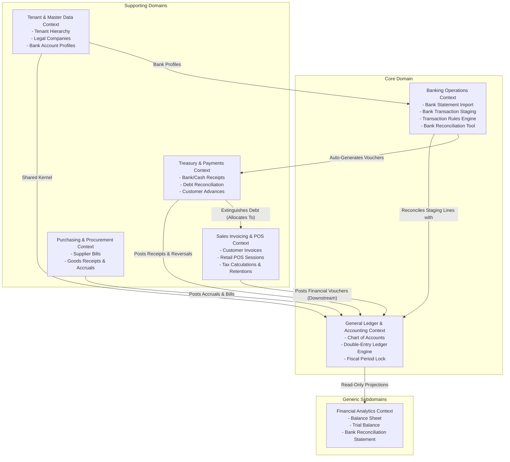

# Domain-Driven Design (DDD) Business Specification & Rules

**Project:** Multi-Tenant Cloud ERP Core  
**Methodology:** Strategic & Tactical Domain-Driven Design (DDD)  
**Status:** APPROVED & MANDATORY  
**Target Domain:** Enterprise Accounting, Banking Operations, Sales Invoicing & Treasury Reconciliation  
**Architectural Parity:** ERPNext Core & Banking App Architecture (`gitdiagram.com/frappe/erpnext`)  

---

## 1. Strategic Design: Ubiquitous Language (Lenguaje Ubicuo)

| Term (Ubiquitous Language) | Spanish Equivalent | Business Definition & Boundary |
| :--- | :--- | :--- |
| **Tenant** | Inquilino / Organización | The top-level isolation boundary representing an independent customer organization. |
| **Company** | Empresa / Entidad Legal | A legal tax entity operating under a Tenant. Holds its own Chart of Accounts, currency, and tax ID. |
| **Chart of Accounts (COA)** | Plan de Cuentas | The hierarchical taxonomy of all financial accounts (Assets, Liabilities, Equity, Income, Expenses). |
| **Group Account** | Cuenta de Grupo / Mayor | A non-posting parent folder in the COA used solely for summarizing sub-account balances. Direct postings are forbidden. |
| **Leaf / Posting Account** | Cuenta Auxiliar / Afectable | A terminal account in the COA where journal entries can be booked. |
| **General Ledger (GL)** | Libro Mayor | The immutable central repository of all financial transactions recorded as debits and credits. |
| **GL Entry** | Asiento / Línea de Mayor | An atomic, immutable record in the General Ledger representing a single debit or credit movement. |
| **Double-Entry Balance** | Partida Doble | The fundamental accounting law stating that total debits must equal total credits for any voucher ($\sum D = \sum C$). |
| **Bank Account** | Cuenta Bancaria | A record linking a real-world commercial bank account with a specific GL Account. |
| **Bank Statement Import** | Importación de Extracto | A batch document representing an uploaded financial statement file (OFX, QIF, CSV, MT940). |
| **Bank Transaction** | Transacción Bancaria | A staging entity representing an unconfirmed debit or credit line recorded by the bank. |
| **Bank Transaction Rule** | Regla de Transacción Bancaria | A configurable heuristic rule (matching description, regex, or amount) that auto-assigns vouchers or accounts to bank transactions. |
| **Bank Reconciliation Tool** | Conciliador Bancario | A dual-sided engine matching external Bank Transactions against internal GL Entries or Payment Entries. |
| **Voucher Dialog** | Diálogo de Creación Rápida | A UI modal allowing immediate on-the-fly creation of missing payment vouchers directly from unmatched bank lines. |
| **Sales Invoice** | Factura de Venta | A commercial claim for payment issued to a Customer for goods or services delivered. |
| **Payment Entry** | Recibo de Pago / Cobro | A treasury transaction recording the inflow of money into a liquid asset account (Bank/Cash). |
| **Payment Allocation** | Asignación de Pago | The association between a Payment Entry and a Sales Invoice, reducing the invoice's outstanding balance. |
| **Outstanding Amount** | Saldo Pendiente | The remaining unpaid monetary value of a posted invoice ($\text{GrandTotal} - \sum \text{Allocations}$). |
| **Advance Payment** | Anticipo de Cliente | The unallocated surplus of a payment where $\text{PaidAmount} > \sum \text{AllocatedAmount}$. |
| **Fiscal Period Lock** | Cierre de Periodo Fiscal | An administrative boundary preventing any new or altered entries within a closed date range. |
| **Point of Sale (POS)** | Punto de Venta | High-speed retail checkout cashier session submitting instant invoices with immediate cash/card payments. |

---

## 2. Strategic Design: Bounded Contexts & Context Map

---

## 3. Tactical Design: Aggregates, Entities & Value Objects

### 3.1 Aggregate: `BankTransaction` & `BankStatementImport` (Banking Operations)

- **Aggregate Root 1:** `BankStatementImport`
  - Properties: `TenantId`, `CompanyId`, `BankAccountId`, `FileName`, `ImportDate`, `TotalTransactionsCount`, `ImportStatus` (`Pending`, `Processed`, `Failed`).
- **Aggregate Root 2:** `BankTransaction` (Staging Entity)
  - Properties:
    - `TenantId`, `CompanyId`, `BankAccountId`
    - `TransactionDate: DateOnly`
    - `Deposit: decimal` (Inflow / Money In)
    - `Withdrawal: decimal` (Outflow / Money Out)
    - `Description: string` (Raw bank statement line narrative)
    - `ReferenceNumber: string` (Check number / wire transfer reference)
    - `BankPartyName: string` (Extracted payer/payee string)
    - `Status: BankTransactionStatus` (`Unreconciled`, `Matched`, `Reconciled`, `Excluded`)
    - `AllocatedAmount: decimal`
    - `MatchedVoucherType: string?` (`Payment Entry`, `Sales Invoice`, `Journal Entry`)
    - `MatchedVoucherId: Guid?`

#### Invariants & Business Rules of `BankTransaction`:
1. **Staging Isolation Invariant:** Importing a bank statement line creates a `BankTransaction` in **staging**, not a General Ledger entry. No accounting entries exist until formal reconciliation or voucher generation takes place.
2. **Mutual Inflow/Outflow Exclusivity:** Either `Deposit > 0` and `Withdrawal == 0`, or `Withdrawal > 0` and `Deposit == 0`. Both cannot be positive.
3. **Exact Amount Matching Invariant:** A `BankTransaction` can be marked `Reconciled` only when the matched voucher amount exactly equals the bank transaction net amount ($\text{Deposit} - \text{Withdrawal}$).
4. **Multi-Voucher Split Matching:** A single bank transaction may reconcile against multiple invoices/payments provided $\sum \text{VoucherAmounts} == \text{BankTransaction.Amount}$.

---

### 3.2 Aggregate: `BankTransactionRule` (Automated Matching Engine)

- **Aggregate Root:** `BankTransactionRule`
- **Properties:**
  - `RuleName: string`
  - `BankAccountId: Guid?` (Null = applies across all accounts)
  - `ConditionType: MatchCondition` (`Contains`, `StartsWith`, `RegexMatch`, `AmountEquals`)
  - `Pattern: string`
  - `TargetPartyType: string` (`Customer` or `Supplier`)
  - `TargetPartyId: Guid?`
  - `AutoCreateVoucher: bool`
  - `TargetExpenseAccountId: Guid?` (e.g. for bank fees or interest)

#### Rule Evaluation Logic:
When a bank statement is imported:
1. The engine iterates over each `BankTransaction` in `Unreconciled` status.
2. It evaluates active `BankTransactionRule` records ordered by priority.
3. If a pattern matches (e.g., description contains `STRIPE PAYOUT`):
   - Automatically identifies the Customer/Supplier.
   - If `AutoCreateVoucher == true` and an unambiguous open invoice exists, it creates a `PaymentEntry` and sets `Status = Matched`.

---

### 3.3 Aggregate: `SalesInvoice` & Point of Sale (`POSInvoice`)

- **Standard Sales Invoice:** As detailed in Section 3.1, enforces double-entry rules upon post.
- **POS Invoicing Variant (`POSInvoice`):**
  - High-speed cashier checkout.
  - Combines invoice creation and payment into a single atomic transaction:
    - **Debit:** Cash / Card Clearing Account (Immediate Payment).
    - **Credit:** Sales Revenue Account.
    - **Credit:** Taxes Payable.
  - Status immediately transitions to `Paid` with zero remaining balance.

---

### 3.4 Aggregate: `Account` & `GLEntry` (Core Accounting)

- **`Account`**: Leaf posting accounts vs group folder accounts (`IsGroup`).
- **`GLEntry`**:
  - Invariant 1: $\sum \text{Debit} - \sum \text{Credit} = 0.0000$.
  - Invariant 2: Append-Only immutability.
  - Invariant 3: `Account.IsGroup == false`.

---

## 4. State Transition Matrices & Business Invariants

### 4.1 `BankTransaction` State Transition Matrix
| Current State | Allowed Event / Trigger | Next State | Side Effects & Domain Invariants |
| :--- | :--- | :--- | :--- |
| `Unreconciled` | Import / Heuristic Match | `Matched` | `BankTransactionRule` assigns candidate voucher/party. Staging only; no GL entries. |
| `Unreconciled` | User Exclude / Ignore | `Excluded` | Line marked as non-operational (e.g. erroneous bank charge reversed next day). |
| `Matched` | User / Auto Reconciliation | `Reconciled` | Matched against `PaymentEntry` or `GLEntry`. Clearance date stamped on Bank Account. |
| `Unreconciled` | Voucher Dialog Quick Create | `Reconciled` | Atomic creation of `GLEntry` (Expense/Journal) + instant reconciliation. |
| `Matched` | Rule Unmatch / Discard | `Unreconciled` | Candidate voucher cleared. Staging remains unreconciled. |
| `Reconciled` | Reverse Reconciliation | `Unreconciled` | Permitted only by Finance Manager. Unlinks voucher, removes clearance date, recalculates statement difference. |
| `Excluded` | Restore Transaction | `Unreconciled` | Restores line for active reconciliation. |

### 4.2 `SalesInvoice` State Transition Matrix
| Current State | Allowed Event / Trigger | Next State | Side Effects & Domain Invariants |
| :--- | :--- | :--- | :--- |
| `Draft` | Post / Submit Invoice | `Unpaid` | Generates balanced `GLEntry` (Debit A/R, Credit Revenue, Credit Taxes). Updates Customer outstanding debt. |
| `Draft` | Delete / Discard | `Deleted` | Permitted only in Draft. Physical soft delete without ledger footprint. |
| `Unpaid` | Partial Payment Allocation | `PartiallyPaid` | Deducts allocated amount from `OutstandingAmount`. |
| `Unpaid` / `PartiallyPaid` | Full Payment Allocation | `Paid` | `OutstandingAmount` reaches exactly $0.0000. |
| `Unpaid` / `PartiallyPaid` | Cancel / Credit Note | `Cancelled` | Posts reversing `GLEntry` with counter-values. Disallows direct deletion once posted. |

### 4.3 `PaymentEntry` State Transition Matrix
| Current State | Allowed Event / Trigger | Next State | Side Effects & Domain Invariants |
| :--- | :--- | :--- | :--- |
| `Draft` | Post Payment | `Submitted` | Posts `GLEntry` (Debit Bank/Cash, Credit A/R). Decrements target invoice outstanding balance. |
| `Submitted` | Bank Statement Match | `Cleared` | Matches imported `BankTransaction`. Stamps `ClearanceDate`. |
| `Submitted` | Reverse / Cancel Payment | `Cancelled` | Reverses `GLEntry`, restores invoice outstanding debt. Permitted only if period is unlocked. |

---

## 5. Multi-Currency, FX Variance & Tax Withholding Invariants

1. **Realized Foreign Exchange Gain/Loss Formula:**
   $$\text{FX Variance} = \text{PaidAmount}_{\text{base}} - (\text{SettledForeignAmount} \times \text{InvoiceExchangeRate})$$
   - If variance $> 0$: Credit `Realized FX Gain` (4210).
   - If variance $< 0$: Debit `Realized FX Loss` (5210).
2. **Fiscal Period Hard Lock Invariant:**
   - Any command modifying or inserting records where `PostingDate <= Company.FiscalLockDate` is immediately rejected with `FiscalPeriodLockedException`.
3. **Tax Withholding & Retention Invariant:**
   - Applicable withholding taxes (e.g. VAT withholding, income tax retention) reduce the net payable to the supplier while creating a direct tax authority liability entry:
   $$\text{Debit Expense/Inventory} = \text{Net} + \text{VAT}, \quad \text{Credit Retention Liability} = \text{Retention}, \quad \text{Credit Accounts Payable} = \text{Total} - \text{Retention}$$
