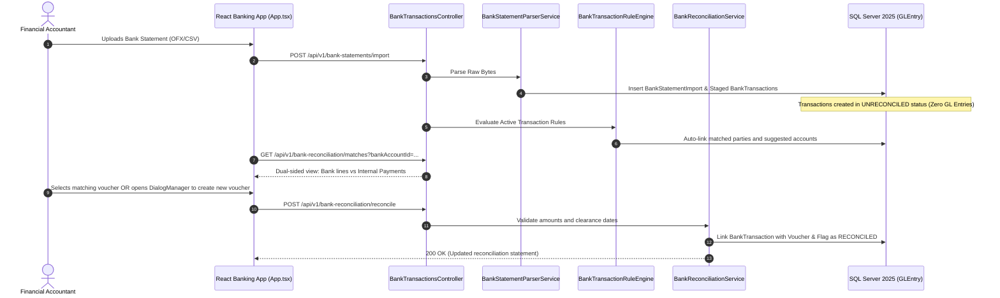

# Technical Architecture Plan: Multi-Tenant Cloud ERP Core

**Status:** APPROVED  
**Format:** Spec Kit Technical Design Document  
**Version:** 2.1.0  
**Stack:** .NET Aspire (.NET 9/10), Microsoft SQL Server 2025, Entity Framework Core, React 19 + TypeScript, Zustand, Axios, Radix UI / ShadcnBlocks  
**Architectural Parity:** ERPNext Architecture Diagram (`banking/src/App.tsx`, `gl_entry.py`, `accounts_controller.py`, `pos_controller.js`, `buying_controller.py`)  

### Modular Technical Plans (GitHub Spec Kit Triad: Spec · Plan · Tasks):
| Module | Certification | Functional Spec | Technical Plan | Tasks Roadmap |
| :--- | :---: | :--- | :--- | :--- |
| **01. Accounting & General Ledger** | `100% CERTIFIED` | [spec.md](./modules/01-accounting/spec.md) | [plan.md](./modules/01-accounting/plan.md) | [tasks.md](./modules/01-accounting/tasks.md) |
| **02. Stock & Inventory (Kardex FIFO)** | `100% CERTIFIED` | [spec.md](./modules/02-stock/spec.md) | [plan.md](./modules/02-stock/plan.md) | [tasks.md](./modules/02-stock/tasks.md) |
| **03. Selling & Point of Sale (POS)** | `100% CERTIFIED` | [spec.md](./modules/03-selling/spec.md) | [plan.md](./modules/03-selling/plan.md) | [tasks.md](./modules/03-selling/tasks.md) |
| **04. Buying & Procurement** | `100% CERTIFIED` | [spec.md](./modules/04-buying/spec.md) | [plan.md](./modules/04-buying/plan.md) | [tasks.md](./modules/04-buying/tasks.md) |
| **05. Banking & Reconciliation Subsystem** | `100% CERTIFIED` | [spec.md](./modules/05-banking/spec.md) | [plan.md](./modules/05-banking/plan.md) | [tasks.md](./modules/05-banking/tasks.md) |
| **06. Manufacturing & Production (BOM)** | `100% CERTIFIED` | [spec.md](./modules/06-manufacturing/spec.md) | [plan.md](./modules/06-manufacturing/plan.md) | [tasks.md](./modules/06-manufacturing/tasks.md) |
| **07. Asset Management & Depreciation** | `100% CERTIFIED` | [spec.md](./modules/07-assets/spec.md) | [plan.md](./modules/07-assets/plan.md) | [tasks.md](./modules/07-assets/tasks.md) |
| **08. CRM & Sales Pipeline** | `100% CERTIFIED` | [spec.md](./modules/08-crm/spec.md) | [plan.md](./modules/08-crm/plan.md) | [tasks.md](./modules/08-crm/tasks.md) |
| **09. Human Resources & Payroll** | `100% CERTIFIED` | [spec.md](./modules/09-hr-payroll/spec.md) | [plan.md](./modules/09-hr-payroll/plan.md) | [tasks.md](./modules/09-hr-payroll/tasks.md) |

---

## 1. Solution & Project Topology (Clean Architecture + .NET Aspire)

### 1.1 Dependency Direction & Layer Inversion Rule

```
[ Domain ] (Core - No External Dependencies)
    ▲
    │ references
[ Application ] (Use Cases, Commands, Queries, Interfaces)
    ▲                   ▲
    │ references        │ implements interfaces
[ Infrastructure ]      [ Presentation / Api ]
 (EF Core, SQL Server)   (Controllers, Middlewares)
    ▲                   ▲
    └─────────┬─────────┘
              │ orchestrated by
      [ Erp.AppHost ] (.NET Aspire)
```

---

## 2. Banking Subsystem & Dual-Sided Reconciliation Architecture

In direct alignment with ERPNext's architecture (`group_bank_ui` and `group_bank_domain`), the banking engine operates through an isolated staging tier before reconciling into the General Ledger.



---

## 3. Database Schema & Indexing (Microsoft SQL Server 2025)

```sql
-- 1. Tenant Table
CREATE TABLE Tenant (
    Id UNIQUEIDENTIFIER PRIMARY KEY DEFAULT NEWSEQUENTIALID(),
    Name NVARCHAR(100) NOT NULL,
    Code NVARCHAR(50) NOT NULL UNIQUE,
    IsActive BIT NOT NULL DEFAULT 1,
    CreatedAt DATETIMEOFFSET NOT NULL DEFAULT SYSDATETIMEOFFSET()
);

-- 2. Company Table
CREATE TABLE Company (
    Id UNIQUEIDENTIFIER PRIMARY KEY DEFAULT NEWSEQUENTIALID(),
    TenantId UNIQUEIDENTIFIER NOT NULL,
    Name NVARCHAR(150) NOT NULL,
    DefaultCurrency NVARCHAR(3) NOT NULL DEFAULT 'USD',
    TaxId NVARCHAR(50) NOT NULL,
    PeriodLockDate DATE NULL,
    AllowNegativeStock BIT NOT NULL DEFAULT 0,
    CreatedAt DATETIMEOFFSET NOT NULL DEFAULT SYSDATETIMEOFFSET(),
    CONSTRAINT FK_Company_Tenant FOREIGN KEY (TenantId) REFERENCES Tenant(Id)
);
CREATE NONCLUSTERED INDEX IX_Company_Tenant ON Company (TenantId);

-- 3. Account Table (Hierarchical Chart of Accounts with Temporal History)
CREATE TABLE Account (
    Id UNIQUEIDENTIFIER PRIMARY KEY DEFAULT NEWSEQUENTIALID(),
    TenantId UNIQUEIDENTIFIER NOT NULL,
    CompanyId UNIQUEIDENTIFIER NOT NULL,
    AccountCode NVARCHAR(50) NOT NULL,
    AccountName NVARCHAR(150) NOT NULL,
    RootType NVARCHAR(20) NOT NULL, -- Asset, Liability, Equity, Income, Expense
    IsGroup BIT NOT NULL DEFAULT 0,
    ParentAccountId UNIQUEIDENTIFIER NULL,
    Currency NVARCHAR(3) NOT NULL DEFAULT 'USD',
    IsActive BIT NOT NULL DEFAULT 1,
    ValidFrom DATETIME2 GENERATED ALWAYS AS ROW START HIDDEN NOT NULL,
    ValidTo DATETIME2 GENERATED ALWAYS AS ROW END HIDDEN NOT NULL,
    PERIOD FOR SYSTEM_TIME (ValidFrom, ValidTo),
    CONSTRAINT FK_Account_Company FOREIGN KEY (CompanyId) REFERENCES Company(Id),
    CONSTRAINT FK_Account_Parent FOREIGN KEY (ParentAccountId) REFERENCES Account(Id)
) WITH (SYSTEM_VERSIONING = ON (HISTORY_TABLE = dbo.AccountHistory));

CREATE NONCLUSTERED INDEX IX_Account_Tenant_Company_Code 
ON Account (TenantId, CompanyId, AccountCode);

-- 4. Bank Account Record (Links real-world bank details to an Account)
CREATE TABLE BankAccount (
    Id UNIQUEIDENTIFIER PRIMARY KEY DEFAULT NEWSEQUENTIALID(),
    TenantId UNIQUEIDENTIFIER NOT NULL,
    CompanyId UNIQUEIDENTIFIER NOT NULL,
    BankName NVARCHAR(150) NOT NULL,
    AccountNumber NVARCHAR(100) NOT NULL,
    GlAccountId UNIQUEIDENTIFIER NOT NULL,
    Currency NVARCHAR(3) NOT NULL DEFAULT 'USD',
    IsActive BIT NOT NULL DEFAULT 1,
    CreatedAt DATETIMEOFFSET NOT NULL DEFAULT SYSDATETIMEOFFSET(),
    CONSTRAINT FK_BankAccount_GLAccount FOREIGN KEY (GlAccountId) REFERENCES Account(Id)
);
CREATE NONCLUSTERED INDEX IX_BankAccount_Tenant ON BankAccount (TenantId, CompanyId);

-- 5. Bank Statement Import Record
CREATE TABLE BankStatementImport (
    Id UNIQUEIDENTIFIER PRIMARY KEY DEFAULT NEWSEQUENTIALID(),
    TenantId UNIQUEIDENTIFIER NOT NULL,
    CompanyId UNIQUEIDENTIFIER NOT NULL,
    BankAccountId UNIQUEIDENTIFIER NOT NULL,
    FileName NVARCHAR(255) NOT NULL,
    ImportDate DATETIMEOFFSET NOT NULL DEFAULT SYSDATETIMEOFFSET(),
    TotalTransactionsCount INT NOT NULL DEFAULT 0,
    Status NVARCHAR(50) NOT NULL DEFAULT 'Processed',
    CONSTRAINT FK_Import_BankAccount FOREIGN KEY (BankAccountId) REFERENCES BankAccount(Id)
);

-- 6. Staged Bank Transactions (Isolated from General Ledger until matched)
CREATE TABLE BankTransaction (
    Id UNIQUEIDENTIFIER PRIMARY KEY DEFAULT NEWSEQUENTIALID(),
    TenantId UNIQUEIDENTIFIER NOT NULL,
    CompanyId UNIQUEIDENTIFIER NOT NULL,
    BankAccountId UNIQUEIDENTIFIER NOT NULL,
    BankStatementImportId UNIQUEIDENTIFIER NULL,
    TransactionDate DATE NOT NULL,
    Deposit DECIMAL(18,4) NOT NULL DEFAULT 0.0000,
    Withdrawal DECIMAL(18,4) NOT NULL DEFAULT 0.0000,
    Description NVARCHAR(MAX) NOT NULL,
    ReferenceNumber NVARCHAR(100) NULL,
    PartyType NVARCHAR(50) NULL,
    PartyId UNIQUEIDENTIFIER NULL,
    Status INT NOT NULL DEFAULT 1, -- 1=Unreconciled, 2=Matched, 3=Reconciled, 4=Excluded
    AllocatedAmount DECIMAL(18,4) NOT NULL DEFAULT 0.0000,
    MatchedVoucherType NVARCHAR(50) NULL,
    MatchedVoucherId UNIQUEIDENTIFIER NULL,
    ClearanceDate DATE NULL,
    CreatedAt DATETIMEOFFSET NOT NULL DEFAULT SYSDATETIMEOFFSET(),
    CONSTRAINT CK_BankTx_Positive CHECK (Deposit >= 0 AND Withdrawal >= 0),
    CONSTRAINT FK_BankTx_BankAccount FOREIGN KEY (BankAccountId) REFERENCES BankAccount(Id),
    CONSTRAINT FK_BankTx_Import FOREIGN KEY (BankStatementImportId) REFERENCES BankStatementImport(Id)
);
CREATE NONCLUSTERED INDEX IX_BankTx_Tenant_Status ON BankTransaction (TenantId, BankAccountId, Status);

-- 7. Bank Transaction Rules (Automated Matching Engine)
CREATE TABLE BankTransactionRule (
    Id UNIQUEIDENTIFIER PRIMARY KEY DEFAULT NEWSEQUENTIALID(),
    TenantId UNIQUEIDENTIFIER NOT NULL,
    CompanyId UNIQUEIDENTIFIER NOT NULL,
    RuleName NVARCHAR(100) NOT NULL,
    Priority INT NOT NULL DEFAULT 1,
    BankAccountId UNIQUEIDENTIFIER NULL,
    ConditionType NVARCHAR(50) NOT NULL, -- Contains, StartsWith, RegexMatch, AmountEquals
    Pattern NVARCHAR(255) NOT NULL,
    TargetPartyType NVARCHAR(50) NULL,
    TargetPartyId UNIQUEIDENTIFIER NULL,
    AutoCreateVoucher BIT NOT NULL DEFAULT 0,
    TargetExpenseAccountId UNIQUEIDENTIFIER NULL,
    IsActive BIT NOT NULL DEFAULT 1
);

-- 8. General Ledger Entries (Immutable Audit Ledger)
CREATE TABLE GLEntry (
    Id BIGINT IDENTITY(1,1) PRIMARY KEY CLUSTERED,
    TenantId UNIQUEIDENTIFIER NOT NULL,
    CompanyId UNIQUEIDENTIFIER NOT NULL,
    PostingDate DATE NOT NULL,
    AccountId UNIQUEIDENTIFIER NOT NULL,
    Debit DECIMAL(18,4) NOT NULL DEFAULT 0.0000,
    Credit DECIMAL(18,4) NOT NULL DEFAULT 0.0000,
    VoucherType NVARCHAR(50) NOT NULL,
    VoucherNo NVARCHAR(100) NOT NULL,
    PartyType NVARCHAR(50) NULL,
    PartyId UNIQUEIDENTIFIER NULL,
    Remarks NVARCHAR(MAX) NULL,
    CreatedAt DATETIMEOFFSET NOT NULL DEFAULT SYSDATETIMEOFFSET(),
    CONSTRAINT CK_Debit_Positive CHECK (Debit >= 0),
    CONSTRAINT CK_Credit_Positive CHECK (Credit >= 0),
    CONSTRAINT FK_GLEntry_Account FOREIGN KEY (AccountId) REFERENCES Account(Id)
);
CREATE NONCLUSTERED INDEX IX_GLEntry_Tenant_Account_Date 
ON GLEntry (TenantId, AccountId, PostingDate)
INCLUDE (Debit, Credit, VoucherType, VoucherNo);

-- 9. Sales Invoicing & POS Invoices
CREATE TABLE SalesInvoice (
    Id UNIQUEIDENTIFIER PRIMARY KEY DEFAULT NEWSEQUENTIALID(),
    TenantId UNIQUEIDENTIFIER NOT NULL,
    CompanyId UNIQUEIDENTIFIER NOT NULL,
    CustomerId UNIQUEIDENTIFIER NOT NULL,
    DocumentNumber NVARCHAR(50) NOT NULL,
    PostingDate DATE NOT NULL,
    DueDate DATE NOT NULL,
    Currency NVARCHAR(3) NOT NULL DEFAULT 'USD',
    Status INT NOT NULL DEFAULT 1,
    IsPOS BIT NOT NULL DEFAULT 0,
    SubTotal DECIMAL(18,4) NOT NULL DEFAULT 0.0000,
    TaxTotal DECIMAL(18,4) NOT NULL DEFAULT 0.0000,
    GrandTotal DECIMAL(18,4) NOT NULL DEFAULT 0.0000,
    OutstandingAmount DECIMAL(18,4) NOT NULL DEFAULT 0.0000,
    Remarks NVARCHAR(MAX) NULL,
    CreatedAt DATETIMEOFFSET NOT NULL DEFAULT SYSDATETIMEOFFSET()
);
```

---

## 4. Banking Controller & Application Contracts

```csharp
namespace Erp.Api.Controllers.V1;

[ApiController]
[Route("api/v1/banking")]
[Authorize(Policy = "TenantMember")]
[Produces("application/json")]
public class BankingController : ControllerBase
{
    private readonly IBankReconciliationService _recService;
    private readonly IBankStatementParserService _parserService;

    public BankingController(
        IBankReconciliationService recService,
        IBankStatementParserService parserService)
    {
        _recService = recService;
        _parserService = parserService;
    }

    [HttpPost("statements/import")]
    [Consumes("multipart/form-data")]
    [ProducesResponseType(typeof(BankStatementImportSummaryDto), StatusCodes.Status200OK)]
    public async Task<ActionResult<BankStatementImportSummaryDto>> ImportStatement(
        [FromForm] ImportStatementRequest request,
        CancellationToken ct)
    {
        var result = await _parserService.ImportAsync(request, ct);
        return Ok(result);
    }

    [HttpGet("reconciliation/unmatched")]
    [ProducesResponseType(typeof(List<BankTransactionDto>), StatusCodes.Status200OK)]
    public async Task<ActionResult<List<BankTransactionDto>>> GetUnmatched(
        [FromQuery] Guid bankAccountId,
        CancellationToken ct)
    {
        var result = await _recService.GetUnreconciledTransactionsAsync(bankAccountId, ct);
        return Ok(result);
    }

    [HttpPost("reconciliation/match")]
    [ProducesResponseType(StatusCodes.Status200OK)]
    public async Task<IActionResult> MatchTransaction(
        [FromBody] MatchBankTransactionCommand command,
        CancellationToken ct)
    {
        await _recService.MatchTransactionWithVoucherAsync(command, ct);
        return Ok();
    }
}
```

---

## 5. Frontend Banking Architecture (React SPA Parity: `banking/src/App.tsx`)

Following ERPNext's structure (`group_bank_ui`):

```text
src/Frontend/erp-client/src/features/banking/
├── App.tsx                                   # Sub-router for banking operations
├── pages/
│   ├── BankReconciliationPage.tsx            # Main dual-sided matching interface
│   └── BankStatementImporterPage.tsx         # Drag-and-drop file uploader (OFX/CSV)
├── components/
│   ├── ReconciliationTable.tsx               # Bank line vs Voucher matching grid
│   ├── AutoMatchRuleBadge.tsx                # Visual indicator when rule matched
│   ├── VoucherDialogManager.tsx              # Quick voucher creation modal
│   └── BankStatementLogList.tsx              # History of uploaded statement batches
└── store/
    └── useBankingStore.ts                    # Active bank account, staged lines state
```
