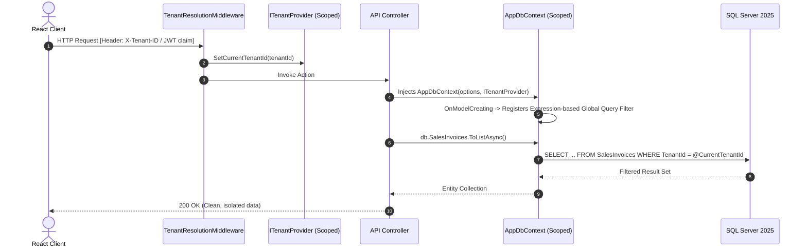
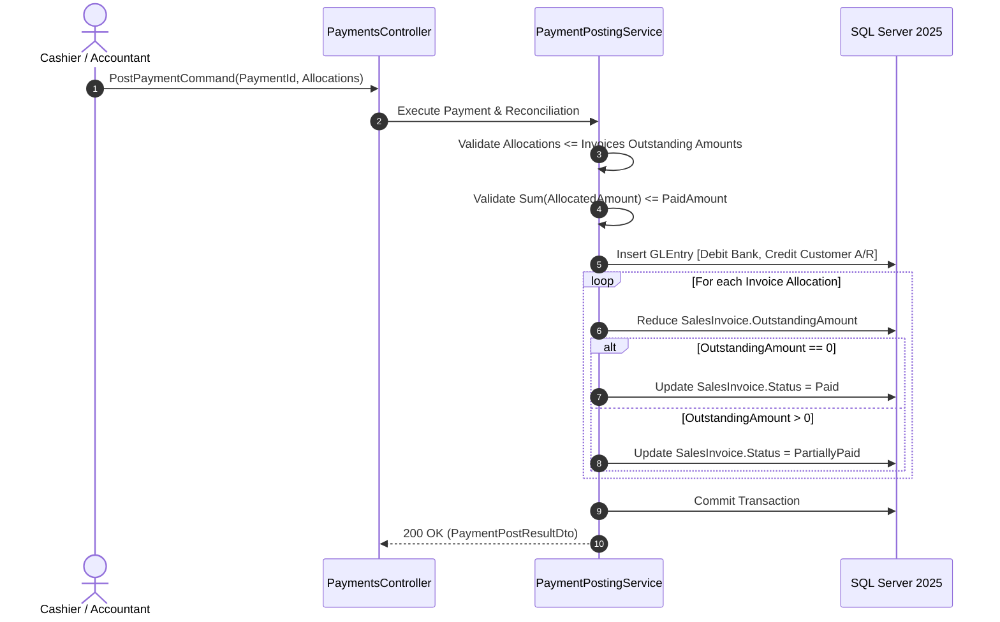

# Technical Architecture Plan: Multi-Tenant Cloud ERP Core

**Status:** APPROVED  
**Format:** Spec Kit Technical Design Document  
**Version:** 1.0.0  
**Stack:** .NET Aspire (.NET 9/10), Microsoft SQL Server 2025, Entity Framework Core, React 19 + TypeScript, Zustand, Axios, Radix UI / ShadcnBlocks  

---

## 1. Solution & Project Topology (Clean Architecture + .NET Aspire)

### 1.1 Dependency Direction & Layer Inversion Rule

```
[ Domain ] (Core - No External Dependencies)
    ▲
    │ references
[ Application ] (Use Cases, Commands, Queries, Interfaces)
    ▲                   ▲
    │ references        │ implements interfaces
[ Infrastructure ]      [ Presentation / Api ]
 (EF Core, SQL Server)   (Controllers, Middlewares)
    ▲                   ▲
    └─────────┬─────────┘
              │ orchestrated by
      [ Erp.AppHost ] (.NET Aspire)
```

**Architectural Law:** Dependencies flow strictly inwards.
- **`Domain`**: Pure C# domain logic (Entities, Value Objects, Domain Events, Domain Exceptions). Zero third-party dependencies.
- **`Application`**: CQRS Commands, Queries, DTOs, Domain Service Interfaces, FluentValidation.
- **`Infrastructure`**: EF Core `AppDbContext`, SQL Server 2025 configurations, migrations, Roslyn `[LoggerMessage]` loggers.
- **`Api`**: REST Controllers with versioning, OpenAPI documentation, Idempotency filters, Middlewares.
- **`AppHost`**: .NET Aspire orchestrator managing SQL Server 2025 container, Redis, API, and Frontend bindings.
- **`ServiceDefaults`**: Shared OpenTelemetry metrics, distributed tracing, and resilience pipelines.

### 1.2 Full Solution Directory Structure

```text
c:/Workspace/Odoo/aspire-erp/
├── .specify/
│   ├── constitution.md                   # Non-negotiable architectural laws
│   ├── spec.md                           # Functional PRD & Gherkin user stories
│   ├── plan.md                           # This comprehensive technical blueprint
│   └── tasks.md                          # Granular phase-by-phase implementation tasks
│
├── src/
│   ├── Backend/
│   │   ├── Erp.Domain/                   # Enterprise Domain Layer (Pure C#)
│   │   │   ├── Common/                   # BaseEntity, AggregateRoot, ValueObject
│   │   │   ├── Entities/                 # Company, Account, GLEntry, SalesInvoice, Customer, PaymentEntry
│   │   │   ├── Events/                   # InvoicePostedEvent, PaymentPostedEvent
│   │   │   ├── Exceptions/               # DoubleEntryImbalanceException, PeriodClosedException
│   │   │   └── Repositories/             # IAccountRepository, ISalesInvoiceRepository
│   │   │
│   │   ├── Erp.Application/              # Application Layer (CQRS & Contracts)
│   │   │   ├── Common/                   # PagedResult, Result<T>, ITenantProvider, IDateTimeProvider
│   │   │   ├── Behaviors/                # ValidationBehavior (FluentValidation), LoggingBehavior
│   │   │   ├── Features/                 # Vertical Slices by Bounded Context
│   │   │   │   ├── Invoicing/
│   │   │   │   │   ├── Commands/         # CreateSalesInvoiceCommand, PostSalesInvoiceCommand
│   │   │   │   │   ├── Queries/          # GetInvoiceByIdQuery, GetInvoicesPagedQuery
│   │   │   │   │   └── Services/         # SalesInvoicePostingService
│   │   │   │   ├── Payments/
│   │   │   │   │   ├── Commands/         # CreatePaymentCommand, PostPaymentCommand
│   │   │   │   │   ├── Queries/          # GetPaymentsPagedQuery
│   │   │   │   │   └── Services/         # PaymentPostingService
│   │   │   │   └── Accounts/
│   │   │   │       ├── Commands/         # CreateAccountCommand
│   │   │   │       └── Queries/          # GetAccountTreeQuery, GetTrialBalanceQuery
│   │   │   └── DTOs/                     # Data Transfer Objects
│   │   │
│   │   ├── Erp.Infrastructure/           # Infrastructure & Persistence
│   │   │   ├── Data/                     # AppDbContext, Interceptors, Migrations
│   │   │   │   ├── Configurations/       # EF Core Fluent API Configurations
│   │   │   │   └── Interceptors/         # TenantSecurityInterceptor, AuditingInterceptor
│   │   │   ├── Repositories/             # EF Core Repository Implementations
│   │   │   └── Logging/                  # High-Performance [LoggerMessage] Loggers
│   │   │
│   │   ├── Erp.Api/                      # Presentation Layer (REST API)
│   │   │   ├── Controllers/V1/           # SalesInvoicesController, PaymentsController, AccountsController
│   │   │   ├── Middleware/               # TenantResolutionMiddleware, TenantLoggingScopeMiddleware
│   │   │   ├── Filters/                  # IdempotencyFilter, ApiExceptionFilter
│   │   │   └── Program.cs                # Dependency Injection Composition Root
│   │   │
│   │   ├── Erp.ServiceDefaults/          # Aspire Shared Telemetry, HealthChecks, Resilience
│   │   └── Erp.AppHost/                  # Aspire Host (SQL Server 2025, Redis, API)
│   │
│   └── Frontend/
│       └── erp-client/                   # React 19 + TypeScript + Vite + Tailwind
│           ├── src/
│           │   ├── api/                  # Axios Client with Tenant & Bearer Interceptors
│           │   ├── components/layout/    # AppSidebar, AppHeader, TenantSwitcher, UserNav
│           │   ├── components/ui/        # Radix UI + Tailwind Primitives (Shadcn UI)
│           │   ├── features/             # Vertical Feature Slices
│           │   │   ├── dashboard/        # ShadcnBlocks Dashboard (KPIs, Charts)
│           │   │   ├── invoicing/        # Invoice Studio, Real-time Tax Calculator
│           │   │   ├── payments/         # Payment Processing & Reconciliation Grid
│           │   │   └── accounting/       # Collapsible Account Tree, General Ledger
│           │   ├── store/                # Zustand Stores (useTenantStore, useInvoiceDraftStore)
│           │   └── types/                # TypeScript Interfaces matching Application DTOs
```

---

## 2. Multi-Tenancy Architecture (Scoped DbContext Injection)

### 2.1 Request Lifecycle & Scoped Resolution



### 2.2 Enterprise `AppDbContext` Contract

```csharp
namespace Erp.Infrastructure.Data;

public interface ITenantEntity
{
    Guid TenantId { get; set; }
}

public interface ITenantProvider
{
    Guid GetCurrentTenantId();
    bool HasTenant();
}

public class AppDbContext : DbContext
{
    private readonly ITenantProvider _tenantProvider;

    public AppDbContext(
        DbContextOptions<AppDbContext> options,
        ITenantProvider tenantProvider) : base(options)
    {
        _tenantProvider = tenantProvider ?? throw new ArgumentNullException(nameof(tenantProvider));
    }

    public DbSet<Tenant> Tenants => Set<Tenant>();
    public DbSet<Company> Companies => Set<Company>();
    public DbSet<Account> Accounts => Set<Account>();
    public DbSet<Customer> Customers => Set<Customer>();
    public DbSet<SalesInvoice> SalesInvoices => Set<SalesInvoice>();
    public DbSet<SalesInvoiceItem> SalesInvoiceItems => Set<SalesInvoiceItem>();
    public DbSet<GLEntry> GLEntries => Set<GLEntry>();
    public DbSet<PaymentEntry> PaymentEntries => Set<PaymentEntry>();
    public DbSet<PaymentAllocation> PaymentAllocations => Set<PaymentAllocation>();

    protected override void OnModelCreating(ModelBuilder modelBuilder)
    {
        base.OnModelCreating(modelBuilder);
        modelBuilder.ApplyConfigurationsFromAssembly(typeof(AppDbContext).Assembly);

        // Apply Global Query Filter to all ITenantEntity implementations dynamically via Expression Trees
        foreach (var entityType in modelBuilder.Model.GetEntityTypes())
        {
            if (typeof(ITenantEntity).IsAssignableFrom(entityType.ClrType))
            {
                var parameter = Expression.Parameter(entityType.ClrType, "e");
                var property = Expression.Property(parameter, nameof(ITenantEntity.TenantId));
                var tenantIdMethod = Expression.Property(
                    Expression.Constant(_tenantProvider),
                    nameof(ITenantProvider.GetCurrentTenantId));
                
                var filter = Expression.Lambda(
                    Expression.Equal(property, Expression.Invoke(tenantIdMethod)),
                    parameter);

                modelBuilder.Entity(entityType.ClrType).HasQueryFilter(filter);
            }
        }
    }

    public override Task<int> SaveChangesAsync(CancellationToken cancellationToken = default)
    {
        var tenantId = _tenantProvider.GetCurrentTenantId();

        foreach (var entry in ChangeTracker.Entries<ITenantEntity>())
        {
            if (entry.State == EntityState.Added)
            {
                entry.Entity.TenantId = tenantId;
            }
            else if (entry.State == EntityState.Modified)
            {
                // Prevent altering tenant identity once created
                entry.Property(nameof(ITenantEntity.TenantId)).IsModified = false;
            }
        }

        return base.SaveChangesAsync(cancellationToken);
    }
}
```

---

## 3. Enterprise Logging Pattern (Structured & High-Performance)

### 3.1 Multi-Tenant Ambient Logging Scope (Middleware)

```csharp
namespace Erp.Api.Middleware;

public class TenantLoggingScopeMiddleware
{
    private readonly RequestDelegate _next;
    private readonly ILogger<TenantLoggingScopeMiddleware> _logger;

    public TenantLoggingScopeMiddleware(RequestDelegate next, ILogger<TenantLoggingScopeMiddleware> logger)
    {
        _next = next;
        _logger = logger;
    }

    public async Task InvokeAsync(HttpContext context, ITenantProvider tenantProvider)
    {
        var tenantId = tenantProvider.HasTenant() ? tenantProvider.GetCurrentTenantId().ToString() : "anonymous";
        var correlationId = context.TraceIdentifier;
        var userId = context.User.FindFirst(ClaimTypes.NameIdentifier)?.Value ?? "unauthenticated";

        using (_logger.BeginScope(new Dictionary<string, object>
        {
            ["TenantId"] = tenantId,
            ["CorrelationId"] = correlationId,
            ["UserId"] = userId,
            ["RequestPath"] = context.Request.Path.Value ?? ""
        }))
        {
            await _next(context);
        }
    }
}
```

### 3.2 High-Performance Compile-Time Loggers (`[LoggerMessage]`)

```csharp
namespace Erp.Infrastructure.Logging;

public static partial class InvoiceLogs
{
    [LoggerMessage(
        EventId = 1001,
        Level = LogLevel.Information,
        Message = "Draft invoice {InvoiceId} created for Customer {CustomerId} with total {GrandTotal}")]
    public static partial void LogInvoiceCreated(
        this ILogger logger, Guid invoiceId, Guid customerId, decimal grandTotal);

    [LoggerMessage(
        EventId = 1002,
        Level = LogLevel.Information,
        Message = "Invoice {InvoiceId} successfully posted. Generated {GLEntryCount} balanced GL entries for voucher {VoucherNo}")]
    public static partial void LogInvoicePosted(
        this ILogger logger, Guid invoiceId, int glEntryCount, string voucherNo);

    [LoggerMessage(
        EventId = 1003,
        Level = LogLevel.Warning,
        Message = "Invoice {InvoiceId} cancellation attempted. Reversing ledger entries with reason: {Reason}")]
    public static partial void LogInvoiceCancelling(
        this ILogger logger, Guid invoiceId, string reason);

    [LoggerMessage(
        EventId = 2001,
        Level = LogLevel.Error,
        Message = "Posting failed for invoice {InvoiceId}: Double-entry balance mismatch. Debit sum: {DebitSum}, Credit sum: {CreditSum}")]
    public static partial void LogBalanceMismatchError(
        this ILogger logger, Guid invoiceId, decimal debitSum, decimal creditSum);
}
```

---

## 4. API Controller Standard Specification & Attributes

### 4.1 Standard Controller Attributes Matrix

| Attribute | Scope | Purpose |
| :--- | :--- | :--- |
| `[ApiController]` | Class | Enables automatic model validation, HTTP 400 ProblemDetails, and parameter inference. |
| `[Route("api/v1/[controller]")]` | Class | Explicit URI versioning and REST resource naming. |
| `[Authorize(Policy = "TenantMember")]` | Class | Enforces authenticated identity belonging to the target tenant context. |
| `[Produces("application/json")]` | Class | Content negotiation contract. |
| `[Consumes("application/json")]` | Class / Method | Rejects unhandled content types with `415 Unsupported Media Type`. |
| `[ProducesResponseType(...)]` | Method | OpenAPI/Swagger documentation of status codes and return schemas. |
| `[IdempotencyKeyRequired]` | Mutation Methods | Prevents double billing / duplicate voucher postings on network retries. |

### 4.2 Reference Controller: `SalesInvoicesController`

```csharp
namespace Erp.Api.Controllers.V1;

[ApiController]
[Route("api/v1/sales-invoices")]
[Authorize(Policy = "TenantMember")]
[Produces("application/json")]
[Consumes("application/json")]
public class SalesInvoicesController : ControllerBase
{
    private readonly ISalesInvoiceService _invoiceService;
    private readonly ILogger<SalesInvoicesController> _logger;

    public SalesInvoicesController(
        ISalesInvoiceService invoiceService,
        ILogger<SalesInvoicesController> logger)
    {
        _invoiceService = invoiceService;
        _logger = logger;
    }

    [HttpGet]
    [ProducesResponseType(typeof(PagedResult<SalesInvoiceSummaryDto>), StatusCodes.Status200OK)]
    [ProducesResponseType(typeof(ProblemDetails), StatusCodes.Status400BadRequest)]
    [ProducesResponseType(StatusCodes.Status401Unauthorized)]
    public async Task<ActionResult<PagedResult<SalesInvoiceSummaryDto>>> GetAll(
        [FromQuery] InvoiceFilterParams filterParams,
        CancellationToken cancellationToken)
    {
        var result = await _invoiceService.GetPagedInvoicesAsync(filterParams, cancellationToken);
        return Ok(result);
    }

    [HttpGet("{id:guid}", Name = nameof(GetById))]
    [ProducesResponseType(typeof(SalesInvoiceDetailDto), StatusCodes.Status200OK)]
    [ProducesResponseType(typeof(ProblemDetails), StatusCodes.Status404NotFound)]
    public async Task<ActionResult<SalesInvoiceDetailDto>> GetById(
        [FromRoute] Guid id,
        CancellationToken cancellationToken)
    {
        var invoice = await _invoiceService.GetByIdAsync(id, cancellationToken);
        if (invoice == null) return NotFound();
        return Ok(invoice);
    }

    [HttpPost]
    [ProducesResponseType(typeof(SalesInvoiceDetailDto), StatusCodes.Status201Created)]
    [ProducesResponseType(typeof(ValidationProblemDetails), StatusCodes.Status422UnprocessableEntity)]
    public async Task<ActionResult<SalesInvoiceDetailDto>> Create(
        [FromBody] CreateSalesInvoiceRequest request,
        CancellationToken cancellationToken)
    {
        var created = await _invoiceService.CreateDraftAsync(request, cancellationToken);
        _logger.LogInvoiceCreated(created.Id, created.CustomerId, created.GrandTotal);
        return CreatedAtAction(nameof(GetById), new { id = created.Id }, created);
    }

    [HttpPost("{id:guid}/post")]
    [IdempotencyKeyRequired]
    [ProducesResponseType(typeof(InvoicePostResultDto), StatusCodes.Status200OK)]
    [ProducesResponseType(typeof(ProblemDetails), StatusCodes.Status400BadRequest)]
    [ProducesResponseType(typeof(ProblemDetails), StatusCodes.Status409Conflict)]
    public async Task<ActionResult<InvoicePostResultDto>> Post(
        [FromRoute] Guid id,
        [FromHeader(Name = "X-Idempotency-Key")] string idempotencyKey,
        CancellationToken cancellationToken)
    {
        var result = await _invoiceService.PostInvoiceAsync(id, idempotencyKey, cancellationToken);
        _logger.LogInvoicePosted(result.InvoiceId, result.GeneratedGLEntriesCount, result.VoucherNo);
        return Ok(result);
    }

    [HttpPost("{id:guid}/cancel")]
    [ProducesResponseType(typeof(InvoiceCancelResultDto), StatusCodes.Status200OK)]
    [ProducesResponseType(typeof(ProblemDetails), StatusCodes.Status400BadRequest)]
    public async Task<ActionResult<InvoiceCancelResultDto>> Cancel(
        [FromRoute] Guid id,
        [FromBody] CancelInvoiceRequest request,
        CancellationToken cancellationToken)
    {
        _logger.LogInvoiceCancelling(id, request.Reason);
        var result = await _invoiceService.CancelInvoiceAsync(id, request.Reason, cancellationToken);
        return Ok(result);
    }
}
```

---

## 5. Invoicing Engine & Double-Entry Accounting Posting

### 5.1 Accounting Invariant & Double-Entry Rule

When an invoice transitions from `Draft` to `Posted`:
1. **Debit**: Accounts Receivable (Customer asset account) for the full `GrandTotal`.
2. **Credit**: Sales Revenue Accounts (per invoice line item) for the respective `LineTotal` amounts ($\sum \text{LineTotal} = \text{SubTotal}$).
3. **Credit**: Taxes Payable Accounts (per applied tax rate) for the `TaxAmount` totals.
4. **Double-Entry Invariant:**
   $$\sum \text{Debit} - \sum \text{Credit} = 0.0000$$

### 5.2 Transactional Service Implementation (`SalesInvoicePostingService`)

```csharp
namespace Erp.Application.Features.Invoicing.Services;

public class SalesInvoicePostingService : ISalesInvoicePostingService
{
    private readonly AppDbContext _db;
    private readonly IDateTimeProvider _clock;
    private readonly ILogger<SalesInvoicePostingService> _logger;

    public SalesInvoicePostingService(
        AppDbContext db,
        IDateTimeProvider clock,
        ILogger<SalesInvoicePostingService> logger)
    {
        _db = db;
        _clock = clock;
        _logger = logger;
    }

    public async Task<InvoicePostResultDto> PostAsync(
        PostSalesInvoiceCommand command,
        CancellationToken cancellationToken)
    {
        var invoice = await _db.SalesInvoices
            .Include(i => i.Items)
            .Include(i => i.Customer)
            .FirstOrDefaultAsync(i => i.Id == command.InvoiceId, cancellationToken)
            ?? throw new NotFoundException($"Sales Invoice {command.InvoiceId} does not exist.");

        if (invoice.Status != InvoiceStatus.Draft)
            throw new InvalidOperationException($"Invoice cannot be posted because its current status is {invoice.Status}.");

        var receivableAccountId = invoice.Customer.DefaultReceivableAccountId 
            ?? throw new DomainException($"Customer {invoice.Customer.Name} does not have a default receivable account configured.");

        var strategy = _db.Database.CreateExecutionStrategy();
        return await strategy.ExecuteAsync(async () =>
        {
            await using var transaction = await _db.Database.BeginTransactionAsync(IsolationLevel.RepeatableRead, cancellationToken);
            try
            {
                invoice.DocumentNumber = await GenerateNextVoucherNumberAsync(invoice.CompanyId, cancellationToken);
                invoice.Status = InvoiceStatus.Posted;
                invoice.OutstandingAmount = invoice.GrandTotal;

                var glEntries = new List<GLEntry>();

                // A. DEBIT: Accounts Receivable
                glEntries.Add(new GLEntry
                {
                    PostingDate = invoice.PostingDate,
                    CompanyId = invoice.CompanyId,
                    AccountId = receivableAccountId,
                    Debit = invoice.GrandTotal,
                    Credit = 0.0000m,
                    VoucherType = "Sales Invoice",
                    VoucherNo = invoice.DocumentNumber,
                    PartyType = "Customer",
                    PartyId = invoice.CustomerId,
                    Remarks = $"Invoice {invoice.DocumentNumber} for {invoice.Customer.Name}"
                });

                // B. CREDIT: Revenue Accounts per line item
                foreach (var item in invoice.Items)
                {
                    glEntries.Add(new GLEntry
                    {
                        PostingDate = invoice.PostingDate,
                        CompanyId = invoice.CompanyId,
                        AccountId = item.IncomeAccountId,
                        Debit = 0.0000m,
                        Credit = item.LineTotal,
                        VoucherType = "Sales Invoice",
                        VoucherNo = invoice.DocumentNumber,
                        PartyType = "Customer",
                        PartyId = invoice.CustomerId,
                        Remarks = item.Description
                    });

                    // C. CREDIT: Taxes Payable
                    if (item.TaxAmount > 0)
                    {
                        glEntries.Add(new GLEntry
                        {
                            PostingDate = invoice.PostingDate,
                            CompanyId = invoice.CompanyId,
                            AccountId = item.TaxAccountId,
                            Debit = 0.0000m,
                            Credit = item.TaxAmount,
                            VoucherType = "Sales Invoice",
                            VoucherNo = invoice.DocumentNumber,
                            Remarks = $"Tax ({item.TaxRatePercentage}%) on {item.Description}"
                        });
                    }
                }

                // Invariant Verification
                var totalDebits = glEntries.Sum(e => e.Debit);
                var totalCredits = glEntries.Sum(e => e.Credit);

                if (Math.Round(totalDebits, 4) != Math.Round(totalCredits, 4))
                {
                    _logger.LogBalanceMismatchError(invoice.Id, totalDebits, totalCredits);
                    throw new DoubleEntryImbalanceException(
                        $"Transaction unbalanced! Total Debits: {totalDebits:N4} != Total Credits: {totalCredits:N4}");
                }

                await _db.GLEntries.AddRangeAsync(glEntries, cancellationToken);
                await _db.SaveChangesAsync(cancellationToken);
                await transaction.CommitAsync(cancellationToken);

                _logger.LogInvoicePosted(invoice.Id, glEntries.Count, invoice.DocumentNumber);

                return new InvoicePostResultDto(
                    invoice.Id,
                    invoice.DocumentNumber,
                    invoice.Status.ToString(),
                    glEntries.Count,
                    totalDebits,
                    totalCredits,
                    _clock.UtcNow
                );
            }
            catch
            {
                await transaction.RollbackAsync(cancellationToken);
                throw;
            }
        });
    }

    private async Task<string> GenerateNextVoucherNumberAsync(Guid companyId, CancellationToken ct)
    {
        var year = _clock.UtcNow.Year;
        var count = await _db.SalesInvoices
            .CountAsync(i => i.CompanyId == companyId && i.PostingDate.Year == year && i.Status != InvoiceStatus.Draft, ct);
        return $"SINV-{year}-{(count + 1):D5}";
    }
}
```

---

## 6. Payments & Account Reconciliation Engine

### 6.1 Payment Double-Entry Accounting Rule

When a customer payment is confirmed and posted:
1. **Debit**: Bank or Cash Account (`PaidToAccountId`) for `PaidAmount` (Liquid Asset increases).
2. **Credit**: Accounts Receivable Account (`PartyReceivableAccountId`) for `PaidAmount` (Customer Debt decreases).
3. **Double-Entry Invariant:**
   $$\text{Debit (Bank)} = \text{Credit (Accounts Receivable)} = \text{PaidAmount}$$



---

## 7. Database Schema & Indexing (Microsoft SQL Server 2025)

```sql
-- 1. Tenant Table
CREATE TABLE Tenant (
    Id UNIQUEIDENTIFIER PRIMARY KEY DEFAULT NEWSEQUENTIALID(),
    Name NVARCHAR(100) NOT NULL,
    Code NVARCHAR(50) NOT NULL UNIQUE,
    IsActive BIT NOT NULL DEFAULT 1,
    CreatedAt DATETIMEOFFSET NOT NULL DEFAULT SYSDATETIMEOFFSET()
);

-- 2. Company Table (Multi-Company per Tenant)
CREATE TABLE Company (
    Id UNIQUEIDENTIFIER PRIMARY KEY DEFAULT NEWSEQUENTIALID(),
    TenantId UNIQUEIDENTIFIER NOT NULL,
    Name NVARCHAR(150) NOT NULL,
    DefaultCurrency NVARCHAR(3) NOT NULL DEFAULT 'USD',
    TaxId NVARCHAR(50) NOT NULL,
    CreatedAt DATETIMEOFFSET NOT NULL DEFAULT SYSDATETIMEOFFSET(),
    CONSTRAINT FK_Company_Tenant FOREIGN KEY (TenantId) REFERENCES Tenant(Id)
);
CREATE NONCLUSTERED INDEX IX_Company_Tenant ON Company (TenantId);

-- 3. Account Table (Hierarchical Chart of Accounts with Temporal History)
CREATE TABLE Account (
    Id UNIQUEIDENTIFIER PRIMARY KEY DEFAULT NEWSEQUENTIALID(),
    TenantId UNIQUEIDENTIFIER NOT NULL,
    CompanyId UNIQUEIDENTIFIER NOT NULL,
    AccountCode NVARCHAR(50) NOT NULL,
    AccountName NVARCHAR(150) NOT NULL,
    RootType NVARCHAR(20) NOT NULL, -- Asset, Liability, Equity, Income, Expense
    IsGroup BIT NOT NULL DEFAULT 0,
    ParentAccountId UNIQUEIDENTIFIER NULL,
    Currency NVARCHAR(3) NOT NULL DEFAULT 'USD',
    IsActive BIT NOT NULL DEFAULT 1,
    ValidFrom DATETIME2 GENERATED ALWAYS AS ROW START HIDDEN NOT NULL,
    ValidTo DATETIME2 GENERATED ALWAYS AS ROW END HIDDEN NOT NULL,
    PERIOD FOR SYSTEM_TIME (ValidFrom, ValidTo),
    CONSTRAINT FK_Account_Company FOREIGN KEY (CompanyId) REFERENCES Company(Id),
    CONSTRAINT FK_Account_Parent FOREIGN KEY (ParentAccountId) REFERENCES Account(Id)
) WITH (SYSTEM_VERSIONING = ON (HISTORY_TABLE = dbo.AccountHistory));

CREATE NONCLUSTERED INDEX IX_Account_Tenant_Company_Code 
ON Account (TenantId, CompanyId, AccountCode);

-- 4. Customer Table
CREATE TABLE Customer (
    Id UNIQUEIDENTIFIER PRIMARY KEY DEFAULT NEWSEQUENTIALID(),
    TenantId UNIQUEIDENTIFIER NOT NULL,
    CompanyId UNIQUEIDENTIFIER NOT NULL,
    Name NVARCHAR(150) NOT NULL,
    TaxId NVARCHAR(50) NOT NULL,
    DefaultReceivableAccountId UNIQUEIDENTIFIER NOT NULL,
    CreatedAt DATETIMEOFFSET NOT NULL DEFAULT SYSDATETIMEOFFSET(),
    CONSTRAINT FK_Customer_ReceivableAccount FOREIGN KEY (DefaultReceivableAccountId) REFERENCES Account(Id)
);
CREATE NONCLUSTERED INDEX IX_Customer_Tenant_Company ON Customer (TenantId, CompanyId);

-- 5. Sales Invoice & Items
CREATE TABLE SalesInvoice (
    Id UNIQUEIDENTIFIER PRIMARY KEY DEFAULT NEWSEQUENTIALID(),
    TenantId UNIQUEIDENTIFIER NOT NULL,
    CompanyId UNIQUEIDENTIFIER NOT NULL,
    CustomerId UNIQUEIDENTIFIER NOT NULL,
    DocumentNumber NVARCHAR(50) NOT NULL,
    PostingDate DATE NOT NULL,
    DueDate DATE NOT NULL,
    Currency NVARCHAR(3) NOT NULL DEFAULT 'USD',
    Status INT NOT NULL DEFAULT 1, -- 1=Draft, 2=Posted, 3=PartiallyPaid, 4=Paid, 5=Cancelled
    SubTotal DECIMAL(18,4) NOT NULL DEFAULT 0.0000,
    TaxTotal DECIMAL(18,4) NOT NULL DEFAULT 0.0000,
    GrandTotal DECIMAL(18,4) NOT NULL DEFAULT 0.0000,
    OutstandingAmount DECIMAL(18,4) NOT NULL DEFAULT 0.0000,
    Remarks NVARCHAR(MAX) NULL,
    CreatedAt DATETIMEOFFSET NOT NULL DEFAULT SYSDATETIMEOFFSET(),
    CONSTRAINT FK_Invoice_Customer FOREIGN KEY (CustomerId) REFERENCES Customer(Id)
);
CREATE NONCLUSTERED INDEX IX_SalesInvoice_Tenant_Status ON SalesInvoice (TenantId, CompanyId, Status);

CREATE TABLE SalesInvoiceItem (
    Id UNIQUEIDENTIFIER PRIMARY KEY DEFAULT NEWSEQUENTIALID(),
    TenantId UNIQUEIDENTIFIER NOT NULL,
    SalesInvoiceId UNIQUEIDENTIFIER NOT NULL,
    Description NVARCHAR(255) NOT NULL,
    Quantity DECIMAL(18,4) NOT NULL,
    UnitPrice DECIMAL(18,4) NOT NULL,
    LineTotal DECIMAL(18,4) NOT NULL,
    TaxRatePercentage DECIMAL(5,2) NOT NULL DEFAULT 0.00,
    TaxAmount DECIMAL(18,4) NOT NULL DEFAULT 0.0000,
    IncomeAccountId UNIQUEIDENTIFIER NOT NULL,
    TaxAccountId UNIQUEIDENTIFIER NOT NULL,
    CONSTRAINT FK_InvoiceItem_Invoice FOREIGN KEY (SalesInvoiceId) REFERENCES SalesInvoice(Id) ON DELETE CASCADE,
    CONSTRAINT FK_InvoiceItem_IncomeAccount FOREIGN KEY (IncomeAccountId) REFERENCES Account(Id),
    CONSTRAINT FK_InvoiceItem_TaxAccount FOREIGN KEY (TaxAccountId) REFERENCES Account(Id)
);

-- 6. Immutable General Ledger Entries (GLEntry)
CREATE TABLE GLEntry (
    Id BIGINT IDENTITY(1,1) PRIMARY KEY CLUSTERED,
    TenantId UNIQUEIDENTIFIER NOT NULL,
    CompanyId UNIQUEIDENTIFIER NOT NULL,
    PostingDate DATE NOT NULL,
    AccountId UNIQUEIDENTIFIER NOT NULL,
    Debit DECIMAL(18,4) NOT NULL DEFAULT 0.0000,
    Credit DECIMAL(18,4) NOT NULL DEFAULT 0.0000,
    VoucherType NVARCHAR(50) NOT NULL,
    VoucherNo NVARCHAR(100) NOT NULL,
    PartyType NVARCHAR(50) NULL,
    PartyId UNIQUEIDENTIFIER NULL,
    Remarks NVARCHAR(MAX) NULL,
    CreatedAt DATETIMEOFFSET NOT NULL DEFAULT SYSDATETIMEOFFSET(),
    CONSTRAINT CK_Debit_Positive CHECK (Debit >= 0),
    CONSTRAINT CK_Credit_Positive CHECK (Credit >= 0),
    CONSTRAINT FK_GLEntry_Account FOREIGN KEY (AccountId) REFERENCES Account(Id)
);
CREATE NONCLUSTERED INDEX IX_GLEntry_Tenant_Account_Date 
ON GLEntry (TenantId, AccountId, PostingDate)
INCLUDE (Debit, Credit, VoucherType, VoucherNo);

-- 7. Payment Entries & Allocations
CREATE TABLE PaymentEntry (
    Id UNIQUEIDENTIFIER PRIMARY KEY DEFAULT NEWSEQUENTIALID(),
    TenantId UNIQUEIDENTIFIER NOT NULL,
    CompanyId UNIQUEIDENTIFIER NOT NULL,
    PaymentNumber NVARCHAR(50) NOT NULL,
    PaymentType INT NOT NULL,
    PostingDate DATE NOT NULL,
    PartyId UNIQUEIDENTIFIER NOT NULL,
    PaidToAccountId UNIQUEIDENTIFIER NOT NULL,
    PaidAmount DECIMAL(18,4) NOT NULL,
    AllocatedAmount DECIMAL(18,4) NOT NULL DEFAULT 0.0000,
    ReferenceNumber NVARCHAR(100) NOT NULL,
    Status INT NOT NULL DEFAULT 1,
    CreatedAt DATETIMEOFFSET NOT NULL DEFAULT SYSDATETIMEOFFSET(),
    CONSTRAINT FK_Payment_PaidAccount FOREIGN KEY (PaidToAccountId) REFERENCES Account(Id)
);

CREATE TABLE PaymentAllocation (
    Id UNIQUEIDENTIFIER PRIMARY KEY DEFAULT NEWSEQUENTIALID(),
    TenantId UNIQUEIDENTIFIER NOT NULL,
    PaymentEntryId UNIQUEIDENTIFIER NOT NULL,
    SalesInvoiceId UNIQUEIDENTIFIER NOT NULL,
    AllocatedAmount DECIMAL(18,4) NOT NULL,
    CONSTRAINT FK_Alloc_Payment FOREIGN KEY (PaymentEntryId) REFERENCES PaymentEntry(Id),
    CONSTRAINT FK_Alloc_Invoice FOREIGN KEY (SalesInvoiceId) REFERENCES SalesInvoice(Id)
);
```

---

## 8. Frontend Architecture (React 19 + TypeScript + Zustand + ShadcnBlocks)

### 8.1 Axios Client with Tenant Resolution & Resilient Error Handling

```typescript
// src/api/client.ts
import axios, { AxiosError } from 'axios';
import { useAuthStore } from '../store/useAuthStore';
import { useTenantStore } from '../store/useTenantStore';

export interface ProblemDetails {
  type?: string;
  title: string;
  status: number;
  detail?: string;
  errors?: Record<string, string[]>;
}

export const apiClient = axios.create({
  baseURL: import.meta.env.VITE_API_URL || '/api/v1',
  headers: {
    'Content-Type': 'application/json',
  },
});

apiClient.interceptors.request.use((config) => {
  const token = useAuthStore.getState().token;
  const tenantId = useTenantStore.getState().currentTenant?.id;

  if (token) {
    config.headers.Authorization = `Bearer ${token}`;
  }

  if (tenantId) {
    config.headers['X-Tenant-ID'] = tenantId;
  }

  return config;
});

apiClient.interceptors.response.use(
  (response) => response,
  (error: AxiosError<ProblemDetails>) => {
    if (error.response) {
      const { status, data } = error.response;

      if (status === 401) {
        useAuthStore.getState().logout();
      } else if (status === 422 || status === 400) {
        console.error('Validation / Domain Error:', data.detail, data.errors);
      } else if (status === 409) {
        console.warn('Idempotency / Concurrency Conflict:', data.detail);
      }
    }
    return Promise.reject(error);
  }
);
```

### 8.2 State Management (Zustand Stores)

#### Multi-Tenant Store (`useTenantStore.ts`)

```typescript
// src/store/useTenantStore.ts
import { create } from 'zustand';
import { persist } from 'zustand/middleware';

export interface TenantInfo {
  id: string;
  name: string;
  code: string;
}

export interface CompanyInfo {
  id: string;
  name: string;
  currency: string;
}

interface TenantState {
  currentTenant: TenantInfo | null;
  currentCompany: CompanyInfo | null;
  availableTenants: TenantInfo[];
  availableCompanies: CompanyInfo[];
  setTenant: (tenant: TenantInfo) => void;
  setCompany: (company: CompanyInfo) => void;
}

export const useTenantStore = create<TenantState>()(
  persist(
    (set) => ({
      currentTenant: null,
      currentCompany: null,
      availableTenants: [],
      availableCompanies: [],
      setTenant: (tenant) => set({ currentTenant: tenant, currentCompany: null }),
      setCompany: (company) => set({ currentCompany: company }),
    }),
    { name: 'erp_tenant_context' }
  )
);
```

#### Invoice Draft Editor State Machine (`useInvoiceDraftStore.ts`)

```typescript
// src/store/useInvoiceDraftStore.ts
import { create } from 'zustand';

export interface InvoiceItemDraft {
  id: string;
  description: string;
  quantity: number;
  unitPrice: number;
  incomeAccountId: string;
  taxAccountId: string;
  taxRatePercentage: number;
  lineTotal: number;
  taxAmount: number;
}

interface InvoiceDraftState {
  companyId: string;
  customerId: string;
  postingDate: string;
  dueDate: string;
  currency: string;
  items: InvoiceItemDraft[];
  subtotal: number;
  taxTotal: number;
  grandTotal: number;
  remarks: string;

  setItemField: (id: string, field: keyof InvoiceItemDraft, value: any) => void;
  addItem: () => void;
  removeItem: (id: string) => void;
  recalculateTotals: () => void;
  resetDraft: () => void;
}

export const useInvoiceDraftStore = create<InvoiceDraftState>((set, get) => ({
  companyId: '',
  customerId: '',
  postingDate: new Date().toISOString().split('T')[0],
  dueDate: new Date().toISOString().split('T')[0],
  currency: 'USD',
  items: [],
  subtotal: 0,
  taxTotal: 0,
  grandTotal: 0,
  remarks: '',

  addItem: () => {
    const newItem: InvoiceItemDraft = {
      id: crypto.randomUUID(),
      description: '',
      quantity: 1,
      unitPrice: 0,
      incomeAccountId: '',
      taxAccountId: '',
      taxRatePercentage: 16.0,
      lineTotal: 0,
      taxAmount: 0,
    };
    set((state) => ({ items: [...state.items, newItem] }));
    get().recalculateTotals();
  },

  removeItem: (id) => {
    set((state) => ({ items: state.items.filter((item) => item.id !== id) }));
    get().recalculateTotals();
  },

  setItemField: (id, field, value) => {
    set((state) => ({
      items: state.items.map((item) => {
        if (item.id !== id) return item;
        const updated = { ...item, [field]: value };
        
        const qty = Number(updated.quantity) || 0;
        const price = Number(updated.unitPrice) || 0;
        const rate = Number(updated.taxRatePercentage) || 0;
        
        updated.lineTotal = Math.round(qty * price * 10000) / 10000;
        updated.taxAmount = Math.round(updated.lineTotal * (rate / 100) * 10000) / 10000;
        return updated;
      }),
    }));
    get().recalculateTotals();
  },

  recalculateTotals: () => {
    const { items } = get();
    const subtotal = items.reduce((acc, curr) => acc + curr.lineTotal, 0);
    const taxTotal = items.reduce((acc, curr) => acc + curr.taxAmount, 0);
    const grandTotal = Math.round((subtotal + taxTotal) * 10000) / 10000;

    set({ subtotal, taxTotal, grandTotal });
  },

  resetDraft: () => set({
    items: [],
    subtotal: 0,
    taxTotal: 0,
    grandTotal: 0,
    remarks: '',
  }),
}));
```
